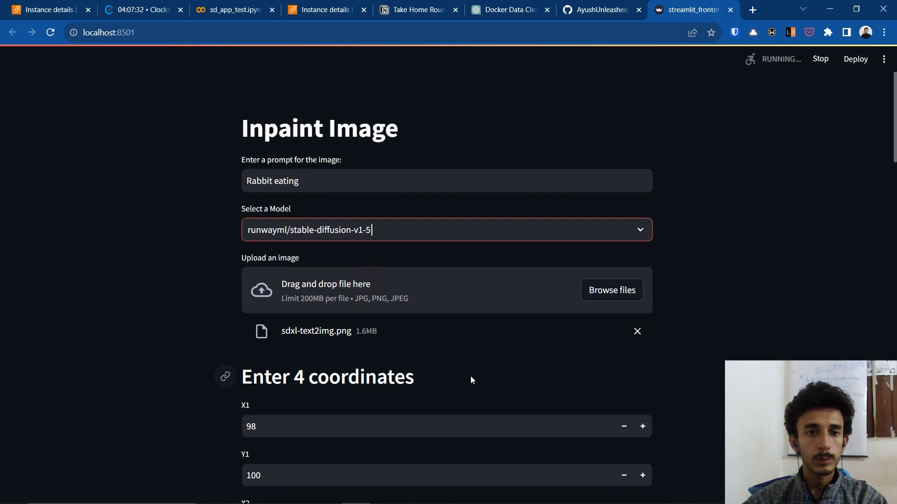
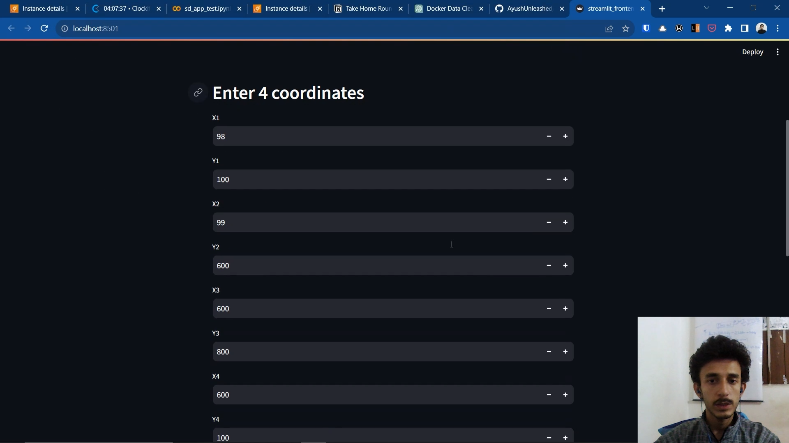
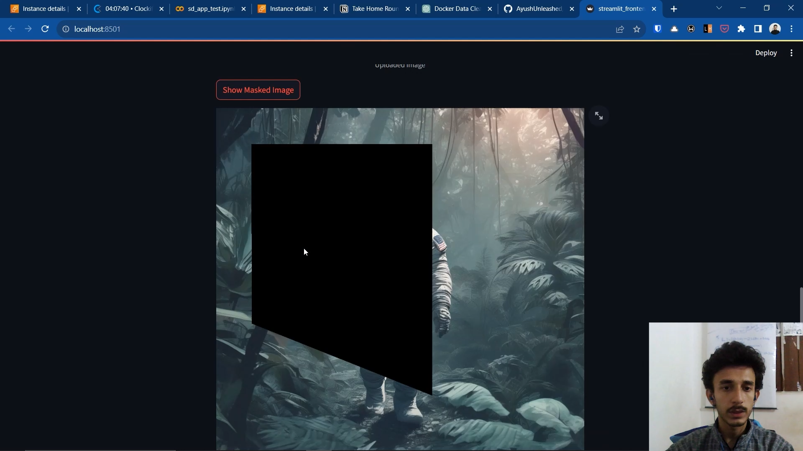
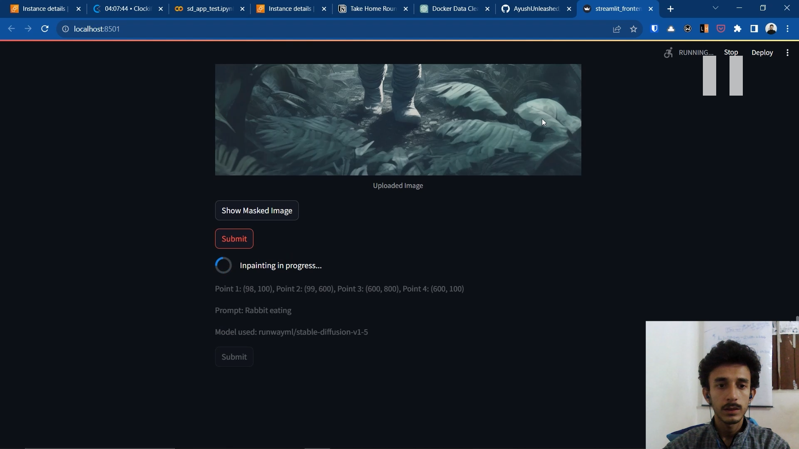
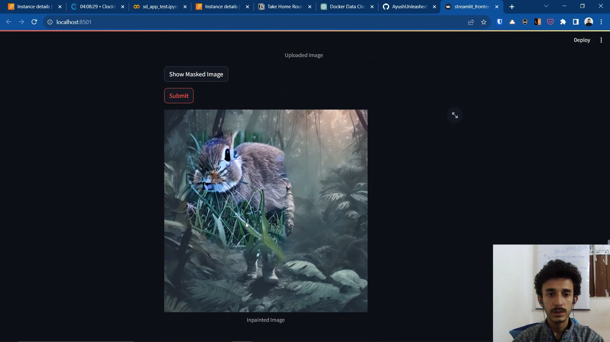

# SDXL-Inpaint

This repository is a dockerized python server that performs inpaint using sdxl model.

# Video Demo

You can watch a video demo of the application by clicking on the link below:

[](https://www.youtube.com/watch?v=Xdjog1_NzsI)

Click on the image above to play the video

[Direct YouTube Link](https://www.youtube.com/watch?v=Xdjog1_NzsI)

## API Reference

#### Check Heartbeat

```http
  GET /heartbeat
```

| Parameter | Type     | Description                |
| :-------- | :------- | :------------------------- |
| `none` | `none` | To Check if server is running |

#### Inpaint Image

```http
  POST /inpaint_image/
```
#### Parameters

| Name             | Type     | Description                        |
| ---------------- | -------- | ---------------------------------- |
| `prompt`         | `string` | **Required**. The prompt for inpainting the image. |
| `encoded_image`  | `string` | **Required**. The encoded image in base64 format. |
| `coordinates`    | `List[Tuple[int, int]]` | **Required**. A list of coordinates specifying the areas to inpaint. |

#### Optional Parameters:

| Name                 | Type     | Default Value       | Description                                     |
| --------------------- | -------- | ------------------- | ----------------------------------------------- |
| `negative_prompt`    | `string` | "deformed, nsfw, blurr" | A string specifying negative prompts.       |
| `base_model`         | `string` | "stabilityai/stable-diffusion-xl-base-1.0" | The Hugging Face model path. |
| `inpaint_strength`   | `float`  | 0.85                | Inpainting strength.                            |
| `num_inference_steps` | `int`   | 30                  | The number of inference steps.                 |
| `guidance_scale`     | `float`  | 7.5                 | The guidance scale.                             |
| `num_images_per_prompt` | `int` | 1                   | The number of inpainted images per prompt.     |

```json
{
  "prompt": "deadpool shooting with guns",
  "encoded_image": "base64_encoded_image_string", 
  "coordinates": [[100, 100], [300, 100], [800, 200], [100, 800]]  
}
```

## Streamlit App Screenshots with Explanations

Below are the screenshots from our Streamlit app along with explanations for each step:

1. **Choose Prompt and Select Stable Diffusion Model**

   

   In this step, we choose a prompt, select the Stable Diffusion model, and upload the image that we want to inpaint.

2. **Enter Coordinates for Inpainting**

   

   Here, we enter the coordinates for the inpainting process. This defines the area of the image that needs to be inpainted.

3. **Show Masked Image Preview**

   

   After entering the coordinates, clicking on "Show Masked Image" will display a preview of the mask, which indicates the area that will be inpainted.

4. **Submit and Start Inpainting**

   

   When you click on the "Submit" button, the inpainting process begins. This step initiates the algorithm to fill in the masked area.

5. **Final Inpainted Image**

   

   As you can see in this final screenshot, the inpainting process is complete, and the image now displays the inpainted area, seamlessly integrating with the rest of the image.

These are the sequential steps in our Streamlit app, which allows you to inpaint images effectively.## Environment Variables

Before running this project, you'll need to set the following environment variable in your `.env` file.

- `BASE_URL`: The base URL for the server endpoint.

### Example:

If you are running the server on an EC2 instance, create a `.env` file and set the `BASE_URL` to the appropriate server endpoint. You should also set the port to 8125. Here's an example of the `.env` file:

```plaintext
BASE_URL=http://your-ec2-server-ip:8125
```

## Backend Deployment

To deploy this project, follow these steps:

**1. Clone the Repository**

Clone the repository to your EC2 instance using the following command:

```bash
git clone https://github.com/AyushUnleashed/sdxl-inpaint.git
```

**2. Navigate to the root directory of the cloned repository:**

```bash
cd sdxl-inpaint
```

**3. Build and Run the Docker Container**

#### 3.1 Build the Container

Build the Docker container by running the following command:

```bash
docker build -t stable-diffusion-server .
```

This command will create a Docker image named `stable-diffusion-server`.

#### 3.2 Run the Container

Start the Docker container using the following command:

```bash
docker run -p 8125:8125 --gpus all stable-diffusion-server
```

- `-p 8125:8125`: Maps port 8125 inside the container to port 8125 on the host (you can change the host port if needed).

- `--gpus all`: Ensures that the container has access to all available GPUs.

The first time you run this command, it may take some time to download the necessary dependencies and data.

##  Run the Frontend

* You can use same requirements.txt file for installation.

After completing the backend setup, you can run the frontend part of your project using Streamlit. Make sure you are in the root directory of the project (sdxl-inpaint). Open a terminal and navigate to the frontend directory:

Then, you can use the following command to run your Streamlit app:

```bash
streamlit run frontend/streamlit_frontend.py
```

This will start the Streamlit app.

## Features

- **Streamlit UI**: Inapint Backend boasts an intuitive Streamlit user interface for seamless interaction with the inpainting functionality.

- **Supports Multiple Stable Diffusion Models**: Users can employ various stable diffusion models for image inpainting by simply providing the path to a Hugging Face model.

## Future Scope

- **Control Net Support**: Upcoming updates will introduce control net support, offering greater precision and control over inpainted results.